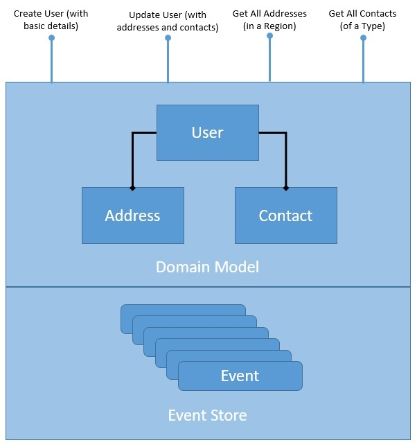
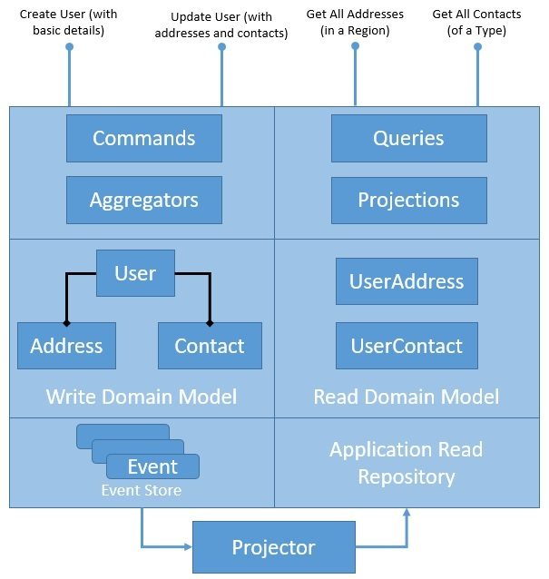

# CQRS Example

## UserService CRUD

Simple implementation, problems are:
* Domain Model: The read and write operations are happening over the same domain model. While this is not a problem for a simple domain model like this, it may worsen as the domain model gets complex. We may need to optimize our domain model and the underlying storage for them to suit the individual needs of the read and write operations.
* Persistence: The persistence we have for our domain objects stores only the latest state of the domain model. While this is sufficient for most situations, it makes some tasks challenging. For instance, if we have to perform a historical audit of how the domain object has changed state, it's not possible here. We have to supplement our solution with some audit logs to achieve this.

## Event sourcing in CRUD
Here, we've structured our repository to store an ordered list of domain events. Every change to the domain object is considered an event: temporal order and immutable.

* PRO
  * Makes write operations much faster as there is no read, update, and write required; write is merely appending an event to a log
  * Removes the object-relational impedance and, hence, the need for complex mapping tools; of course, we still need to recreate the objects back
  * Happens to provide an audit log as a by-product, which is completely reliable; we can debug exactly how the state of a domain model has changed
  * It makes it possible to support temporal queries and achieve time-travel (the domain state at a point in the past)!
  * It's a natural fit for designing loosely coupled components in a microservices architecture that communicate asynchronously by exchanging messages
* CONS
  * There's a learning curve associated and a shift in mindset required to adopt event sourcing; it's not intuitive, to begin with
  * It makes it rather difficult to handle typical queries as we need to recreate the state unless we keep the state in the local cache
  * Although it can be applied to any domain model, it's more appropriate for the event-based model in an event-driven architecture

## UserService with CQRS

In this implementation we:
* Divide read and write
* Use Aggregate pattern: described in Domain-Driven Design (DDD) that logically groups different entities by binding entities to an aggregate root. The aggregate pattern provides transactional consistency between the entities.
* Use Projection pattern: which greatly benefits CQRS, projection essentially means representing domain objects in different shapes and structures.

Definitions:
* Write part:
  * Model: same as before
  * Commands: definitions of commands used to mutate state of domain model
  * Aggregate: takes commands and handle them
* Read part:
  * Model: new domain model centered around queries we have
  * Query: definitions of queries used to get data
  * Projections: takes query and executes
* Projector: service used to sync read and write repo

NB: Please note that it's not convenient to project the current state of the write domain into different read domain models. The example we have taken here is fairly simple, hence, we do not see the problem.

However, as the write and read models get more complex, it'll get increasingly difficult to project. We can address this through event-based projection instead of state-based projection with Event Sourcing

## Considerations about CQRS 
* PRO
  * CQRS provides us a convenient way to select separate domain models appropriate for write and read operations; we don't have to create a complex domain model supporting both
  * It helps us to select repositories that are individually suited for handling the complexities of the read and write operations, like high throughput for writing and low latency for reading
  * It naturally complements event-based programming models in a distributed architecture by providing a separation of concerns as well as simpler domain models
* CONS
  * Only a complex domain model can benefit from the added complexity of this pattern; a simple domain model can be managed without all this
  * Naturally leads to code duplication to some extent, which is an acceptable evil compared to the gain it leads us to
  * Separate repositories lead to problems of consistency, and it's difficult to keep write and read repositories in perfect sync always; we often have to settle for eventual consistency

## CQRS and Event Sourcing

# Reference
Based on [baeldung article](https://www.baeldung.com/cqrs-event-sourcing-java) one of best reference for Java ecosystem