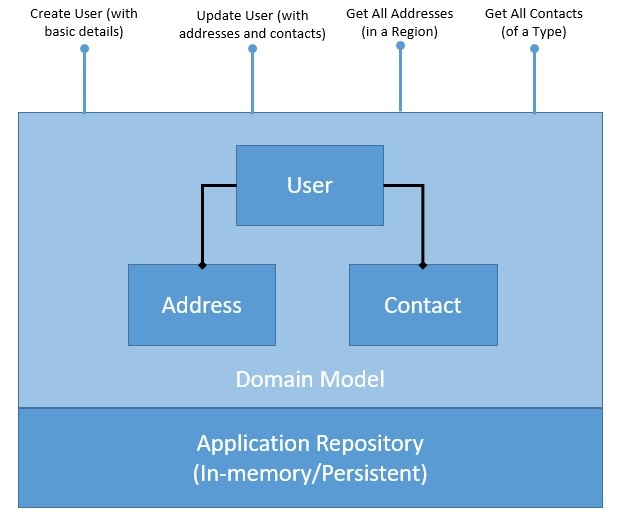
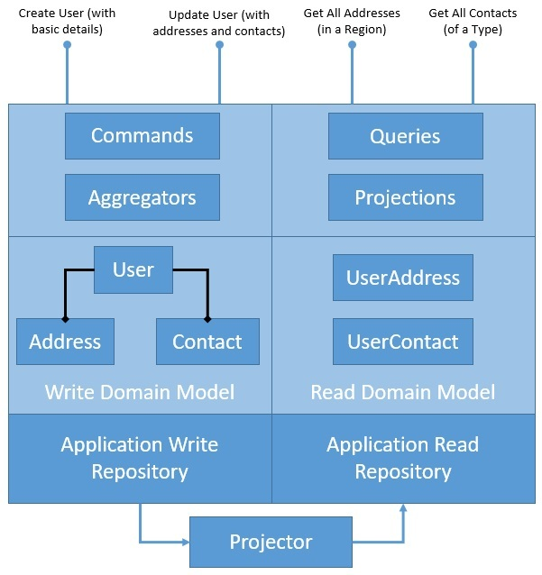

# CQRS Example

## UserService

Simple implementation, problems are:
* Domain Model: The read and write operations are happening over the same domain model. While this is not a problem for a simple domain model like this, it may worsen as the domain model gets complex. We may need to optimize our domain model and the underlying storage for them to suit the individual needs of the read and write operations.
* Persistence: The persistence we have for our domain objects stores only the latest state of the domain model. While this is sufficient for most situations, it makes some tasks challenging. For instance, if we have to perform a historical audit of how the domain object has changed state, it's not possible here. We have to supplement our solution with some audit logs to achieve this.

## UserService2

In this implementation we:
* Divide read and write
* Use Aggregate pattern: described in Domain-Driven Design (DDD) that logically groups different entities by binding entities to an aggregate root. The aggregate pattern provides transactional consistency between the entities.
* Use Projection pattern: which greatly benefits CQRS, projection essentially means representing domain objects in different shapes and structures.

Definitions:
* Write part:
  * Model: same as before
  * Commands: definitions of commands used to mutate state of domain model
  * Aggregate: takes commands and handle them
* Read part:
  * Model: new domain model centered around queries we have
  * Query: definitions of queries used to get data
  * Projections: takes query and executes
* Projector: service used to sync read and write repo

NB: Please note that it's not convenient to project the current state of the write domain into different read domain models. The example we have taken here is fairly simple, hence, we do not see the problem.

However, as the write and read models get more complex, it'll get increasingly difficult to project. We can address this through event-based projection instead of state-based projection with Event Sourcing

# Reference
Based on [baeldung article](https://www.baeldung.com/cqrs-event-sourcing-java) one of best reference for Java ecosystem